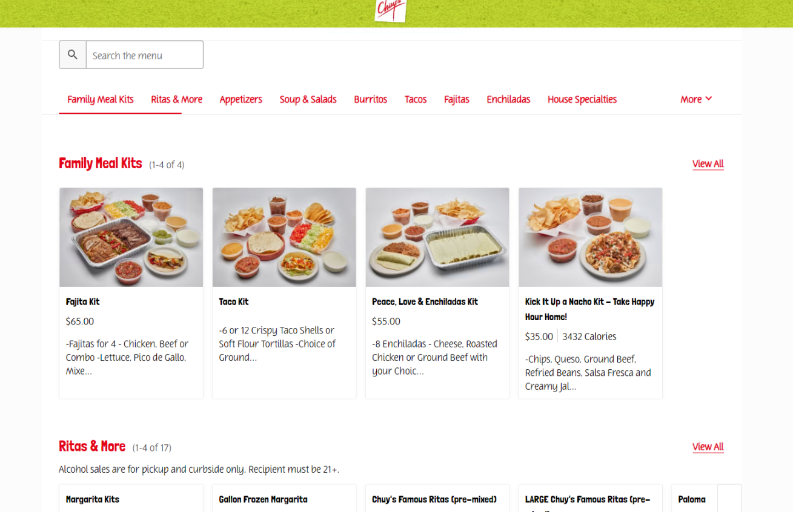

# 🍽️ Web Scraping Project for Restaurants 🍽️

This Python based web scraping project utilizes Selenium to fetch information about various restaurants. 🍳🥘🦪

## Getting started 🚀

To get a local copy up and running, follow the simple steps outlined below.

## Description 📝

This project attempts to simplify the process of finding information about different restaurants.

### _Why choose our scraper?_ 😏

1️⃣ **Efficient:** We implemented Selenium to make the web scraping process more efficient and reliable.

2️⃣ **Easy-to-use:** The scraper is implemented keeping usability in mind, making web scraping an easy task even for beginners.

3️⃣ **Time savior:** The time you would invest in researching various restaurants manually could be wisely saved, and invested elsewhere.

## Usage 🎯

Use this project to your heart's content. Find your favourite restaurants, their dishes, ratings, and so much more with our scraper.

**More instructions here...**

## Contribute 🤝

Contributions, issues, and feature requests are welcome! Feel free to check [issues page](<Your Issues Page Link>).

## 🍔🌮 Happy Scraping! 🍣🍜

---

### ©️2022 Your Name

---
